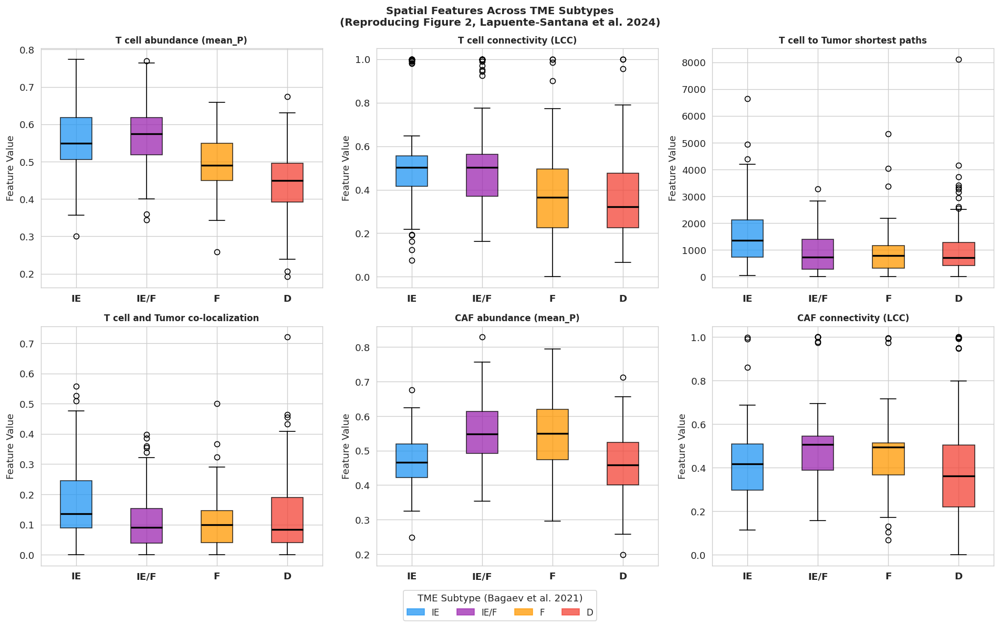
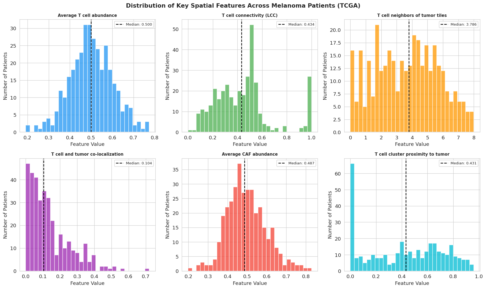
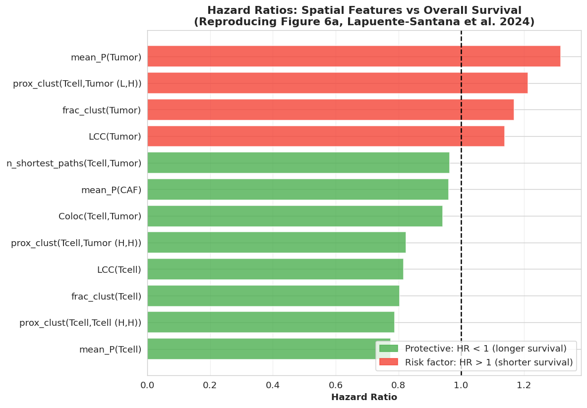
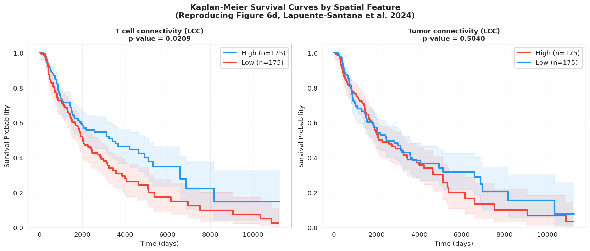
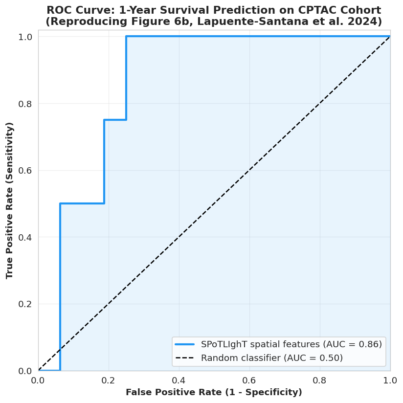
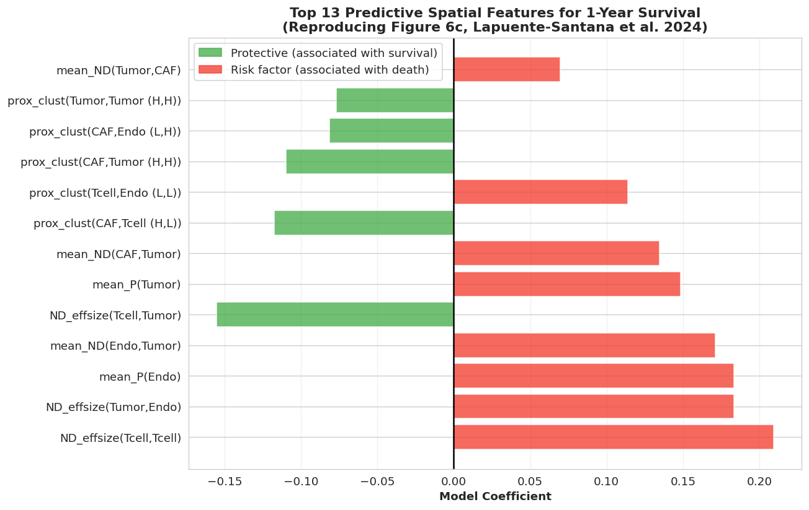

# SPoTLIghT: Integrating Histology and Spatial Transcriptomics

Maheen | Lajeen | Hafsa Asghar

Paper: Integrating histopathology and transcriptomics for spatial tumor microenvironment profiling in a melanoma case study https://doi.org/10.1038/s41698-024-00749-w

## What this paper is about

The whole point of this paper is that doctors already collect H&E stained tissue slides from basically every cancer patient as a routine part of diagnosis. At the same time, RNA sequencing data from these same patients tells you which cell types are present in the tumor. The problem is these two data sources are never really used together in a spatial way. RNA-seq gives you cell type quantities but no location information. H&E images give you spatial structure but you cannot identify specific cell types just by looking at the staining pattern.

This paper builds a tool called SPoTLIghT that bridges this gap. It trains a machine learning model using both H&E imaging features and RNA-seq derived cell type scores and then uses that model to predict where each cell type is located across the entire tissue slide. The output is essentially a spatial map of the tumor microenvironment that you can generate from just a standard H&E slide with no additional sequencing required.

The reason this matters clinically is that where immune cells are located in a tumor turns out to predict patient survival better than just knowing how many immune cells are present. Two patients with identical T cell counts can have completely different outcomes depending on whether those T cells are actually inside the tumor or stuck at the edges.

## Methodology

### Data

They used 379 melanoma patients from TCGA. Every patient had both an H&E slide from fresh frozen tissue and matching bulk RNA-seq data. They focused on four cell types that are most relevant in the tumor microenvironment:

| Cell type | Role in tumor |
|---|---|
| Tumor cells | the cancer cells themselves |
| T cells | immune cells trying to kill the tumor |
| CAFs | cancer associated fibroblasts that often suppress immune activity |
| Endothelial cells | lining the blood vessels that supply the tumor |

### Feature extraction from H&E slides

Each H&E slide is cut into tiles of 512 by 512 pixels at 20x magnification. A pre trained CNN called PC-CHiP processes each tile and produces 1536 imaging features from its last hidden layer. These features capture the visual appearance of the tissue at that location without being explicitly told what to look for.

### Cell type quantification from RNA-seq

For each patient they used multiple published tools to quantify each cell type from RNA-seq. For T cells they used quanTIseq, ssGSEA with cytotoxic and effector T cell signatures, and the ESTIMATE immune score. Using multiple methods per cell type and combining them via multi-task learning makes the signal more reliable than using any single method alone.

### Transfer learning model (RMTLR)

This is the core of the method. RMTLR stands for Regularized Multi-Task Linear Regression. It takes the 1536 tile-level imaging features as input and learns to predict the RNA-seq based cell type scores as output. Multi-task means it predicts all quantification methods for a cell type simultaneously rather than training separate models. The model selects only the imaging features that are genuinely informative which prevents overfitting.

### Spatial probability maps

Once trained the models are applied tile by tile to every slide. Each tile gets a probability value for each cell type. These values are assembled into spatial heatmaps overlaid on the tissue image showing the predicted distribution of each cell type across the slide.

### Graph based spatial features

This part is what makes the paper different from just predicting cell type maps. They convert the tile grid into a graph where tiles are nodes connected to their spatial neighbors. From this graph they extract 96 features across several groups:

| Feature group | What it measures |
|---|---|
| Colocalization | fraction of tiles where two cell types are predicted together |
| LCC (Largest Connected Component) | how connected and spread out a cell type is (0 to 1) |
| Mean Node Degree | average number of direct neighbor tiles of another cell type |
| Shortest paths | number of short paths of length 2 or less between two cell types |
| Cluster proximity | distance between spatially enriched clusters of different cell types |
| Mean probability | overall abundance of a cell type across the whole slide |
| Fraction of clusters | proportion of spatial clusters enriched for a given cell type |

### Validation

The spatial maps were validated by comparing T cell predictions to established TIL maps from Saltz et al. 2018 across 334 FFPE slides, giving a Dice score of 0.92 and Jaccard index of 0.74. They also validated against Xenium spatial transcriptomics data from two 10x Genomics melanoma datasets and found significant correlations for all four cell types.

---

## Results

### TME subtype analysis

Using the TME subtype labels we tested whether the spatial features differ across these groups. The boxplots below show they clearly do.

The IE subtype has the highest T cell abundance and connectivity. IE/F has high T cells but also elevated CAF abundance which explains why these patients respond worse to immunotherapy even though immune cells are present. What we found interesting here is the co-localization plot. IE has noticeably higher T cell and tumor co-localization than IE/F despite having similar T cell counts. This suggests T cells in IE/F patients exist but are spatially separated from the actual tumor cells which is exactly what the fibrotic microenvironment does.

### Feature distributions

T cell co-localization with tumor cells has a median of only 0.104 across 350 patients. We did not expect it to be that low. It means in most melanoma patients barely 10 percent of image tiles contain both T cells and tumor cells together, which suggests immune exclusion is more the norm than the exception in this cancer type.

### Survival analysis

Cox regression on the real TCGA survival data from Liu et al. 2018 confirmed the paper's findings. The results from our analysis:

| Feature | Our HR | Paper HR | Direction |
|---|---|---|---|
| mean_P(Tcell) | 0.775 | 0.07 | Protective |
| LCC(Tcell) | 0.816 | 0.36 | Protective |
| frac_clust(Tcell) | 0.804 | 0.44 | Protective |
| mean_P(Tumor) | 1.317 | 173 | Risk factor |
| prox_clust(Tcell,Tumor (L,H)) | 1.213 | 2.29 | Risk factor |

Note: our hazard ratio magnitudes differ from the paper because the paper used adjusted Cox regression controlling for tumor stage  and restricted stage I-III patients. We used unadjusted Cox regression on all 350 patients though the direction of every finding is identical i.e T cell features are protective, tumor cell features are risk factors.

### Kaplan-Meier curves

Splitting patients by median LCC(Tcell) gives a clearly significant survival difference. Patients with highly connected T cells survive noticeably longer. The tumor LCC comparison is not significant. The paper showed 5 KM curves across different features but we reproduced 2 of them (LCC(Tcell) and LCC(Tumor)). The conclusion matches that T cell connectivity is significantly associated with survival.

### Independent validation on CPTAC

The model trained on TCGA patients was tested on 36 completely separate cancer patients (4 deceased within 1 year, 32 alive). We got AUC = 0.859, the paper reports 0.88. The difference is because the paper ran 100 bootstrap iterations using R's glmnet package and reported the median prediction across all runs while we ran a single model in Python's sklearn. However we got the dsmr conclusion that spatial features from H&E slides predict 1-year survival with AUC close to 0.88 on patients the model never saw.

### Top predictive features

The elastic net model identified the top 13 features for 1-year survival prediction. Our top risk features include endothelial and T cell spatial arrangement features, consistent with the paper's finding that endothelial cluster proximity features dominate the risk predictions. The exact feature ranking differs slightly from the paper because the paper used median coefficients across 100 bootstrap runs while we used a single model run.

## Which GitHub repos exist and which did we use

There are three repositories associated with this paper.

**Repo 1: https://github.com/SysBioOncology/SPoTLIghT**
The full SPoTLIghT pipeline built with Nextflow and Docker. It needs Docker, Apptainer or Singularity and an HPC cluster to run. The input data alone (raw TCGA whole slide images) is hundreds of gigabytes. We did not use this because it cannot run on Google Colab and the setup requirements are beyond what is feasible for reproduction in a notebook environment.

**Repo 2: https://github.com/SysBioOncology/spatial_features_manuscript**
This is the repository the authors made specifically for reproducing the manuscript figures. It contains the final computed spatial features for all patients as CSV files and R notebooks for figure reproduction. We used this repository. The two files we loaded are:
- data/spatial_features_matrix_TCGA.csv (360 patients, 96 features)
- data/spatial_features_matrix_CPTAC.csv (36 patients, 96 features)

**Repo 3: https://github.com/yufu2015/PC-CHiP**
The PC-CHiP deep learning model used in the pipeline for tile-level feature extraction. The authors used this as a pretrained feature extractor inside the SPoTLIghT pipeline. We did not use it directly because the feature extraction step was already completed by the authors and the outputs are embedded in the CSV files from Repo 2.

## Datasets used

| Dataset | Source | What it contains | Used for |
|---|---|---|---|
| spatial_features_matrix_TCGA.csv | Repo 2, authors GitHub | 96 spatial features for 360 TCGA melanoma patients | main analysis and model training |
| spatial_features_matrix_CPTAC.csv | Repo 2, authors GitHub | 96 spatial features for 36 CPTAC melanoma patients | independent validation |
| Liu et al. 2018 Table S1 | Cell journal, supplementary | overall survival data for TCGA patients | survival analysis and KM curves |
| Bagaev et al. 2021 Table S6 | Cancer Cell journal, supplementary | TME subtype labels for TCGA patients | subtype comparison analysis |

The Liu et al. and Bagaev et al. files are not in the authors GitHub repo. They come from two separate published papers that the SPoTLIghT paper references in its Methods section. Both need to be downloaded manually and uploaded when running the Colab notebook.

## How to run the notebook

The Colab notebook is in the colab/ subfolder.

1. Open the notebook in Google Colab
2. Run the first cell to install lifelines and openpyxl
3. When Section 2 runs, upload the file: 1-s2_0-S0092867418302290-mmc1.xlsx (Liu et al. survival data)
4. When Section 3 runs, upload the file: 1-s2_0-S1535610821002221-mmc6.xlsx (Bagaev et al. subtype labels)
5. Run all remaining cells

The spatial feature CSVs download automatically from the authors GitHub. All six figures are saved automatically as PNG files.

No local installation needed. Just a Google account.

## Citation

Lapuente-Santana, O., Kant, J. and Eduati, F. Integrating histopathology and transcriptomics for spatial tumor microenvironment profiling in a melanoma case study. npj Precision Oncology 8, 254 (2024). https://doi.org/10.1038/s41698-024-00749-w

## Authors Github Repos Link 
1. SPoTLIghT pipeline (main tool)
https://github.com/SysBioOncology/SPoTLIghT
2. Manuscript analysis repo (what we used)
https://github.com/SysBioOncology/spatial_features_manuscript
3. PC-CHiP deep learning model
https://github.com/yufu2015/PC-CHiP
